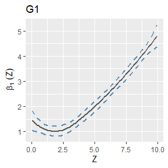
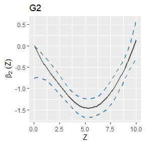

<!-- README.md is generated from README.Rmd. Please edit that file -->

# spinBayes

> **S**emi-**p**arametric GxE **In**teraction via **Bayes**ian Variable
> Selection

<!-- badges: start -->

<!-- badges: end -->

Many complex diseases are known to be affected by the interactions
between genetic variants and environmental exposures beyond the main
genetic and environmental effects. Existing Bayesian methods for
gene-environment (G×E) interaction studies are challenged by the
high-dimensional nature of the study and the complexity of environmental
influences. We have developed a novel and powerful semi-parametric
Bayesian variable selection method that can accommodate linear and
nonlinear G×E interactions simultaneously ([Ren et
al. (2019)](https://arxiv.org/abs/1906.01057)). Furthermore, the
proposed method can conduct structural identification by distinguishing
nonlinear interactions from main effects only case within Bayesian
framework. Spike-and-slab priors are incorporated on both individual and
group level to shrink coefficients corresponding to irrelevant main and
interaction effects to zero exactly. The Markov chain Monte Carlo
algorithms of the proposed and alternative methods are efficiently
implemented in C++.

## Features

- BVCfit() integrates five different models for G×E Bayesian variable
  selection. <!-- + sparse --> <!-- + VC --> <!-- + structural -->
- Generic functions BVSelection(), predict() and plot() make the
  workflow very simple (see ‘Examples’).
- Highly efficient c++ implementation for MCMC algorithm.
  <!-- * Testing coverage >80%  -->
  <!--  -->

## How to install

- To install from github, run these two lines of code in R

<!-- -->

    install.packages("devtools")
    devtools::install_github("jrhub/spinBayes")

- Released versions of spinBayes are available on CRAN
  <!-- [(link)](https://cran.r-project.org/package=spinBayes) --> , and
  can be installed within R via

<!-- -->

    install.packages("spinBayes")

## Examples

<!-- ### Survival response -->

#### Example.1 (default method)

    library(spinBayes)
    data(gExp.L)

    test = sample((1:nrow(X2)), floor(nrow(X2)/5))
    spbayes=BVCfit(X2[-test,], Y2[-test,], Z2[-test,], E2[-test,], clin2[-test,])
    spbayes

    selected = BVSelection(spbayes)
    selected

    pred = predict(spbayes, X2[test,], Z2[test,], E2[test,], clin2[test,], Y2[test,])
    pred$pmse
    # c(pred$y.pred)

    ## plot the varying effects
    plot(spbayes)

<!-- --><!-- --><!-- -->

#### Example.2 (non-structural)

    data(gExp.L)

    test = sample((1:nrow(X2)), floor(nrow(X2)/5))
    spbayes=BVCfit(X2[-test,], Y2[-test,], Z2[-test,], E2[-test,], clin2[-test,], structural=FALSE)
    spbayes

    selected = BVSelection(spbayes)
    selected

    pred = predict(spbayes, X2[test,], Z2[test,], E2[test,], clin2[test,], Y2[test,])
    pred$pmse
    # c(pred$y.pred)

#### Example.3 (non-sparse)

    data(gExp.L)

    test = sample((1:nrow(X2)), floor(nrow(X2)/5))
    spbayes=BVCfit(X2[-test,], Y2[-test,], Z2[-test,], E2[-test,], clin2[-test,], structural=TRUE, sparse=FALSE)
    spbayes

    selected = BVSelection(spbayes)
    selected

    pred = predict(spbayes, X2[test,], Z2[test,], E2[test,], clin2[test,], Y2[test,])
    pred$pmse
    # c(pred$y.pred)

## News

### spinBayes 0.2.0 \[2024-2-21\]

- Added a generic function plot() for plotting identified varying
  effects.
- Updated the documentation.

## Methods

This package provides implementation for methods proposed in

- Ren, J., Zhou, F., Li, X., Chen, Q., Zhang, H., Ma, S., Jiang, Y.,
  Wu, C. (2019) Semi-parametric Bayesian variable selection for
  gene-environment interactions. *Statistics in Medicine* 39: 617– 638.
  <https://doi.org/10.1002/sim.8434>

<!-- ## References -->
<!-- * Wu, C., and Ma, S. (2015). A selective review of robust variable selection with applications in bioinformatics. [Briefings in Bioinformatics, 16(5), 873–883](http://doi.org/10.1093/bib/bbu046) -->
<!-- * Wu, C., Shi, X., Cui, Y. and Ma, S. (2015). A penalized robust semiparametric approach for gene-environment interactions. [Statistics in Medicine, 34 (30): 4016–4030](https://doi.org/10.1002/sim.6609) -->
<!-- * Wu, C, Jiang, Y, Ren, J, Cui, Y, Ma, S. (2018). Dissecting gene-environment interactions: A penalized robust approach accounting for hierarchical structures.[Statistics in Medicine, 37:437–456](https://doi.org/10.1002/sim.7518) -->
